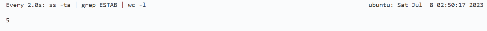
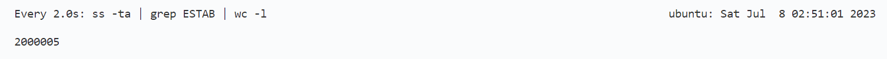

# 实验五 单机TCP并发连接实验 实验报告

## 运行方法

- make生成客户端程序client和服务端程序server
- 服务端监听端口为3200~3219, 在测试时需要确保该20个端口没有被占用
- 至少需要8G内存

## 设计思路

### 客户端和服务端的结构

客户端和服务器均使用单一ip地址，服务器同时在20个端口上监听，客户端用50000个端口分别向这20个监听端口发起连接请求。为了保证客户端请求的并发性，开启4个客户端线程，每个线程负责向5个监听端口轮询式地发起连接。为了保证服务端处理速度，开启4个服务端线程，每个线程负责用epoll同时监听5个端口。客户端和服务端程序都跑在同一台机器上，因此连接建立后总共应该有2000000个套接字。

### 参数调整

- 客户端和服务端都需关注的问题：
  - 进程可打开文件数和系统可打开文件数：百万连接需要百万个套接字文件，因此需要修改进程可打开文件数和系统可打开文件数的限制：
    - 内核参数`fs.nr_open`限制单一进程可打开文件数，使用`sysctl fs.nr_open=1100000`将其修改为1000000+
    - 内核参数`fs.file-max`限制系统总共可打开文件数，使用`sysctl fs.file-max=2100000`将其修改为2000000+
    - 资源限制参数`nofile`同样限制进程可打开文件数，使用`ulimit -n 1100000`将其修改为1000000+
  - 虚拟机内存：每个没有传输数据的套接字大概需要3.7K的内存，因此2000000个套接字大概需要7G的内存。再加上虚拟机中其他程序所占内存，我最终将虚拟机内存扩大为12G
- 客户端需要关注的问题：
  - 在单一ip地址的情况下，客户端需要大量端口以建立大量不同的连接。内核参数`net.ipv4.ip_local_port_range`限制了程序可用端口范围，使用`sysctl net.ipv4.ip_local_port_range=“10000 65535”`，使得客户端至少有50000个可用端口（实际上由于其他程序对端口的占用，设置的可用端口数要比50000多一点）
- 服务端需要关注的问题：
  - 由于短时间内收到大量连接请求而来不及处理，服务端监听套接字的半连接队列和全连接队列可能会积攒得很长，当长度超过限制时，将会导致连接失败
    - 全连接队列长度 = `min{调用listen时传入的backlog参数，内核参数net.core.somaxconn}`，因此要将`net.core.somaxconn`调得稍微大一点，在我的机器上该参数默认为4096，经后续实验验证已经够用，同时在调用listen时传入的backlog参数也要>=4096
    - 半连接队列长度 = `min{调用listen时传入的backlog参数，内核参数net.core.somaxconn, 内核参数net.ipv4.tcp_max_syn_backlog}`，因此也要将`net.ipv4.tcp_max_syn_backlog`也调得稍微大一点，在我的机器上该参数默认为1024，经后续实验验证已经够用。

## 效果展示

